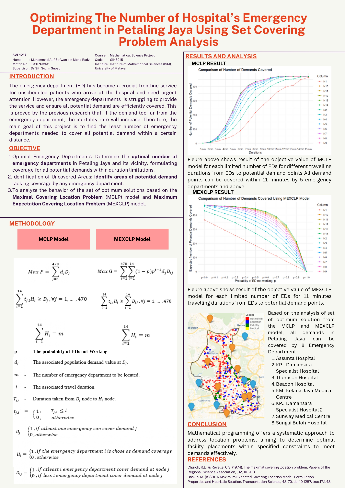

# Optimizing the Number of Hospital's Emergency Department in Petaling Jaya using Set Covering Problem Analysis

This file is a summary of my Mathematical Science project. For full article and citation, please visit Journal of Applied Mathematics and Computational Intelligence or click link [here](https://ejournal.unimap.edu.my/index.php/amci/article/view/1501/1283)

## Abstract

The emergency department (ED) has become a crucial frontline service for unscheduled patients who arrive at the hospital and need urgent attention. However, the emergency departments  is struggling to provide the service and ensure all potential demand are efficiently covered. This is proved by the previous research that, if the demand too far from the emergency department, the mortality rate will increase. Therefore, the main goal of this project is to find the least number of emergency departments needed to cover all potential demand within a certain distance.

## Project Objectives

1. Optimal Emergency Departments : Determine the optimal number of emergency departments in Petaling Jaya and its vicinity, formulating coverage for all potential demands within duration limitations.
2. Identification of Uncovered Areas : Identify areas of potential demand lacking coverage by any emergency department.
3. To analyze the behavior of the set of optimum solutions based on Maximal Covering Location Problem (MCLP) model and Maximum Expectation Covering Location Problem (MEXCLP) model.

## Methodology

Based on set covering location problems, there is three important information as follow :-
1. Emergency Department Location
2. Potential Demand Points Location
3. Travel Distance and Duration Metrics from each emergency department to each potential demands.

### Potential Demand Points and Emergency Departments Location

In total of 470 demand points collected in Petaling Jaya consist of 308 residentials, 45 industry area, 110 education area and 7 medical area.

As for hospitals that provide emergency departments, there is 14 potential hospitals that potentially cover demands in Petaling Jayaas follow :-

| Hospital | City Address |
| --- | --- |
| Assunta Hospital | Petaling Jaya |
| KPJ Damansara Specialist Hospital | Petaling Jaya |
| Columbia Asia Hospital | Petaling Jaya |
| Thomson Hospital | Petaling Jaya |
| Beacon International Specialist Centre | Petaling Jaya |
| KMI Kelana Jaya Medical Centre | Petaling Jaya |
| Park City Medical Centre | Kuala Lumpur |
| University of Malaya Medical Centre | Kuala Lumpur |
| KPJ Damansara Specialist Hospital 2 | Kuala Lumpur |
| MSU Medical Centre | Shah Alam |
| Ara Damansara Medical Centre | Shah Alam |
| Subang Jaya Medical Centre | Subang Jaya |
| Sunway Medical Centre | Subang Jaya |
| Sungai Buloh Hospital | Sungai Buloh |

### Maximal Covering Location Problem Formulation

### Maximum Expected Covering Location Problem Formulation

## The Summary

